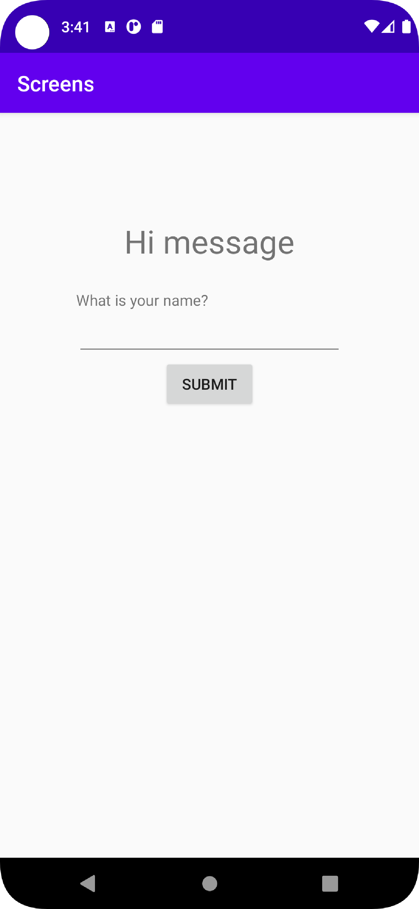
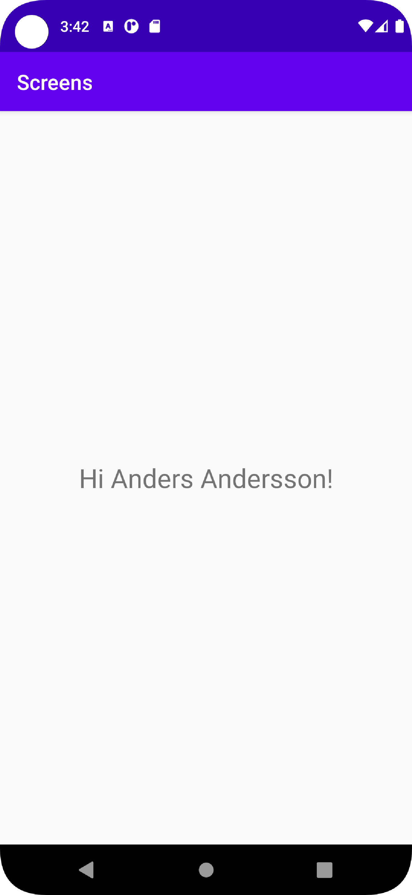
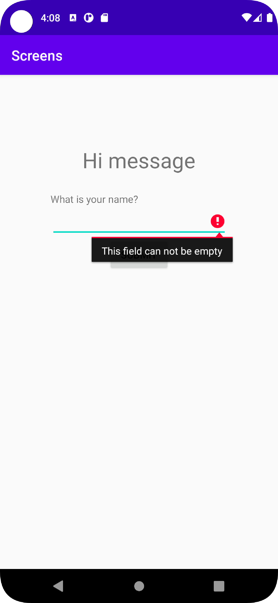

# Rapport

- Först tillades en knapp i main screen, vilken också fick en button listener i Main activity.    
- Därefter skapades en ny activity vilken gjordes med "Intent" (se kod nedan), 
  hur knapptryckningen registrerades har även ändrades efter hur detta utförs i av [Android developer](https://developer.android.com/training/basics/firstapp/starting-activity)

``
Intent intent = new Intent(this, SecondActivity.class);
startActivity(intent);
``
  
- Nästa del i projectet var att "överföra" data mellan de olika skärmarna, 
  här fastställdes då även vad själva syftet med projectet skulle vara, vilket blev att matta in ett namn vilket senare skulle änvändas på nästa skärm. (se bilder)  
- Detta gjordes då genom att ta input ifrån en editText widget och sedan använda ``putExtra("name", message)`` för att det ska integreras med intent och gå att nås i nästa activity. (se kod nedan)
- Senare skapade även if-sats vilken kollar ifall meddelandet är tomt, om det är tomt så påmins användaren om att skriva ett namn. (se kod nedan och bilder)   
``
  public void new_activity(View v) {
    Intent intent = new Intent(this, SecondActivity.class);
    EditText editText = (EditText) findViewById(R.id.name);
    String message = editText.getText().toString();
    if(TextUtils.isEmpty(message)) {
      editText.setError("This field can not be empty");
      return;
    }
    intent.putExtra("name", message);
    startActivity(intent);
  }
``

- I second activity används sedan koden nedan för att komma åt och visa meddelandet i en textView (se bilder)    

``
  Bundle extras = getIntent().getExtras();
  String message = getString(R.string.hi)+ " " + extras.getString("name") + "!";
  TextView textView = findViewById(R.id.textView);
  textView.setText(message);  
``

